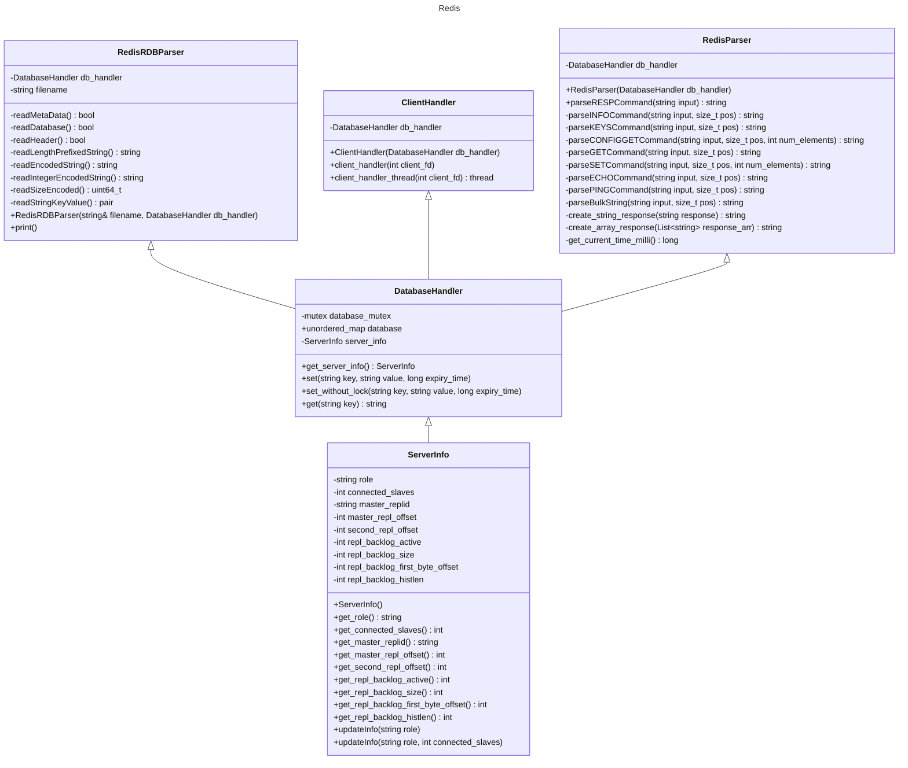

```mermaid
---
title: Redis
---
classDiagram
    RedisRDBParser <|-- DatabaseHandler
    ClientHandler <|-- DatabaseHandler
    RedisParser <|-- DatabaseHandler
    DatabaseHandler <|-- ServerInfo
    class RedisRDBParser{
        -DatabaseHandler db_handler
        -string filename
        -readMetaData() bool
        -readDatabase() bool
        -readHeader() bool
        -readLengthPrefixedString() string
        -readEncodedString() string
        -readIntegerEncodedString() string
        -readSizeEncoded() uint64_t
        -readStringKeyValue() pair
        +RedisRDBParser(string& filename, DatabaseHandler db_handler)
        +print()
    }
    class DatabaseHandler{
        -mutex database_mutex
        +unordered_map database
        -ServerInfo server_info
        +get_server_info() ServerInfo
        +set(string key, string value, long expiry_time) 
        +set_without_lock(string key, string value, long expiry_time)
        +get(string key) string
    }
    class ClientHandler{ 
        +ClientHandler(DatabaseHandler db_handler)
        +client_handler(int client_fd)
        +client_handler_thread(int client_fd) thread
        -DatabaseHandler db_handler
    }
    class RedisParser{
        +RedisParser(DatabaseHandler db_handler)
        +parseRESPCommand(string input) string
        -DatabaseHandler db_handler
        -parseINFOCommand(string input, size_t pos) string
        -parseKEYSCommand(string input, size_t pos) string
        -parseCONFIGGETCommand(string input, size_t pos, int num_elements) string
        -parseGETCommand(string input, size_t pos) string
        -parseSETCommand(string input, size_t pos, int num_elements) string
        -parseECHOCommand(string input, size_t pos) string
        -parsePINGCommand(string input, size_t pos) string
        -parseBulkString(string input, size_t pos) string
        -create_string_response(string response) string
        -create_array_response(List~string~ response_arr) string
        -get_current_time_milli() long
    }
    class ServerInfo{
        +ServerInfo()
        +get_role() string
        +get_connected_slaves() int
        +get_master_replid() string
        +get_master_repl_offset() int
        +get_second_repl_offset() int
        +get_repl_backlog_active() int
        +get_repl_backlog_size() int
        +get_repl_backlog_first_byte_offset() int
        +get_repl_backlog_histlen() int
        +updateInfo(string role)
        +updateInfo(string role, int connected_slaves)
        -string role
        -int connected_slaves
        -string master_replid
        -int master_repl_offset
        -int second_repl_offset
        -int repl_backlog_active
        -int repl_backlog_size
        -int repl_backlog_first_byte_offset
        -int repl_backlog_histlen
    }

```